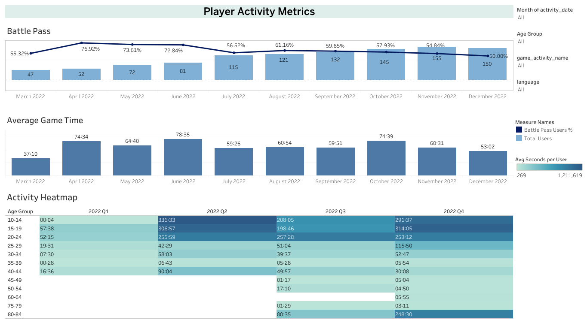

# 🎮 Mobile Gaming Analytics: Player Engagement & Battle Pass Adoption

[](https://public.tableau.com/views/Project_14_1/PlayerActivityMetrics?:language=en-US&:sid=&:redirect=auth&:display_count=n&:origin=viz_share_link)
[](LICENSE)

An end-to-end product analytics dashboard analyzing mobile game user activity, Battle Pass engagement dynamics, playtime distribution, and demographic engagement patterns across quarters.

---

## 📌 Business Context & Objective
The product and game design teams needed granular visibility into player retention and engagement to optimize monetization features (Battle Pass) and identify target user demographics. 

**Key Analytical Objectives:**
- Track monthly Active Users (MAU) and measure **Battle Pass Adoption Rate**.
- Analyze average time spent in-game per unique player.
- Identify core gaming demographics by visualizing engagement via a custom **Age Group × Quarter Heatmap**.
- Provide interactive multi-dimensional filtering (Activity Date, Age Segments, Game Modes, Device Languages).

---

## 🖼 Dashboard Preview



🔗 **Interactive Live Version:** [Open Dashboard on Tableau Public](https://public.tableau.com/views/Project_14_1/PlayerActivityMetrics?:language=en-US&:sid=&:redirect=auth&:display_count=n&:origin=viz_share_link)

---

## 🛠 Technical Implementation & Key Skills
- **BI Tool:** Tableau Desktop / Tableau Public
- **Level of Detail (LOD) Expressions:** Computed fixed user-level aggregates independent of visualization granularity to ensure accurate unique player calculations.
- **Dual-Axis Visualization:** Combined bar charts (Total Active Users) with secondary line axes (Battle Pass Adoption %) for correlation analysis.
- **Custom Time Formatting (`HH:MM`):** Engineered calculated string fields with zero-padding to transform raw seconds into a structured `HH:MM` format for KPIs and tooltips.
- **Demographic Binning:** Segmented player ages into discrete 5-year cohorts (`10-14`, `15-19`, ..., `80-84`) to isolate high-value user clusters.
- **Diverging Color Scales:** Configured gradient heatmaps based on normalized baseline activity to spot behavioral shifts across Q1–Q4 2022.

---

## 🔍 Key Insights & Findings
1. **Battle Pass Peak Adoption:** Battle Pass user share peaked at **76.92% in April 2022**, followed by steady engagement stabilizing around **50–60%** through Q3 and Q4.
2. **Player Scale Growth:** Monthly unique active users steadily grew from **47 (March 2022)** to a peak of **155 (November 2022)**.
3. **Core Demographic Drivers:** Players in age groups **10–24** showed the highest session duration per player, exceeding **300+ hours** in Q2 and Q4, representing the primary driver for long-session engagement.

---

## 📂 Repository Structure
```text
├── dashboards/                  <- Tableau Workbook (.twbx)
├── images/                      <- Dashboard screenshots & UI assets
│   └── dashboard_preview.png
└── README.md                    <- Analytical report & documentation
```

📬 Contact
Author: Oleksandr Hordashevskyi

LinkedIn: www.linkedin.com/in/oleksandr-hordashevskyi

Email: o.hordashevskyi@gmail.com
